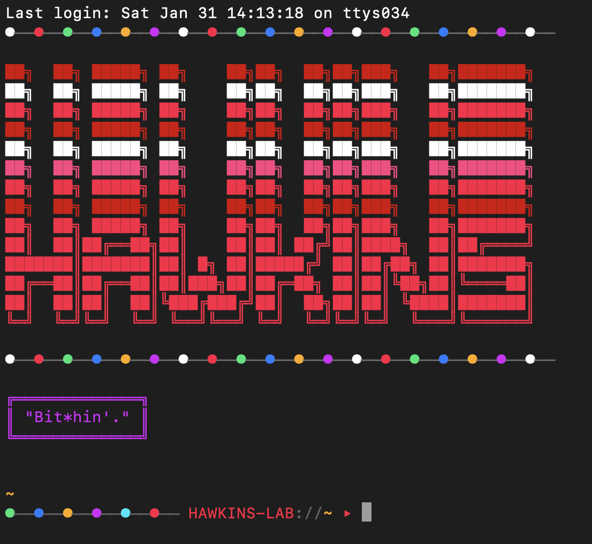
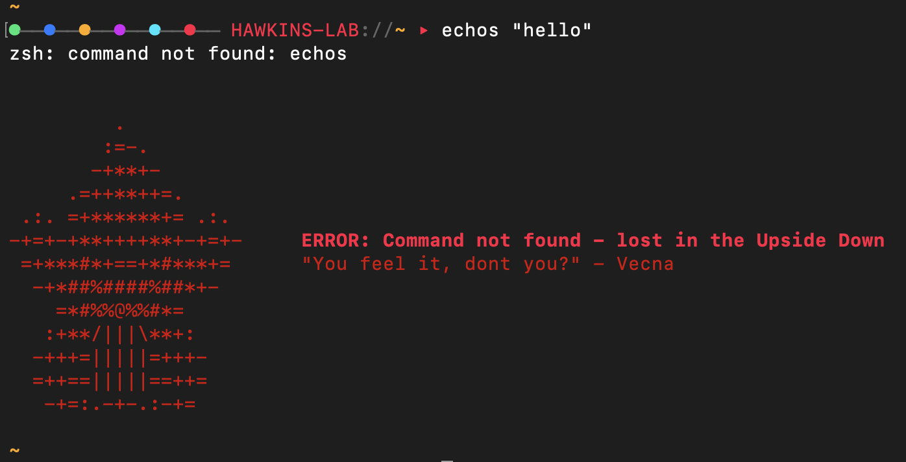
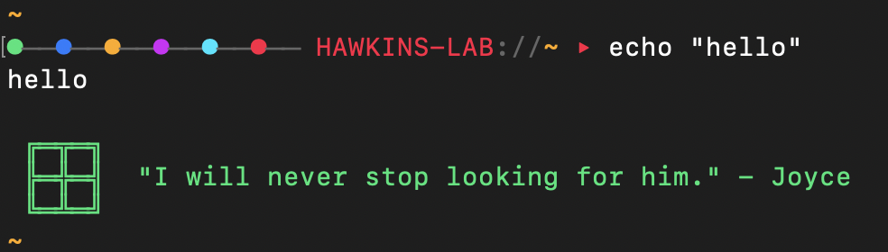

# 📺 Hawkins TTY
### ⌨️ Hawkins Teletypewriter Terminal

> *"Friends don't lie."* — Eleven

A **fan-made tribute terminal experience** for Stranger Things enthusiasts. Transform your command line into a portal to Hawkins, Indiana circa 1983. 🚲✨

> 🎮 *Perfect for kids and beginners — a fun, engaging way to explore the terminal and fall in love with the command line!*

```
██╗  ██╗ █████╗ ██╗    ██╗██╗  ██╗██╗███╗   ██╗███████╗
██║  ██║██╔══██╗██║    ██║██║ ██╔╝██║████╗  ██║██╔════╝
███████║███████║██║ █╗ ██║█████╔╝ ██║██╔██╗ ██║███████╗
██╔══██║██╔══██║██║███╗██║██╔═██╗ ██║██║╚██╗██║╚════██║
██║  ██║██║  ██║╚███╔███╔╝██║  ██╗██║██║ ╚████║███████║
╚═╝  ╚═╝╚═╝  ╚═╝ ╚══╝╚══╝ ╚═╝  ╚═╝╚═╝╚═╝  ╚═══╝╚══════╝

🔴──🟢──🔵──🟡──🟣──🔴──🟢──🔵──🟡──🟣──🔴──🟢──🔵──🟡
```

## 💡 The Why

* 🌙 Small things add up to enhance long hacker hours
* 🎨 A fun way to add some personality to your terminal
* 👶 A playful introduction for young hackers learning the command line
* 🎮 A fun and engaging way to dwell in the terminal and learn more!

## 🌀 The Experience

This isn't just a color scheme — it's a full **immersive terminal experience** for fans who want to feel like they're hacking into Hawkins Lab or tuning into a walkie-talkie frequency from the Upside Down.

**Features:**
- 🎄 **Christmas Lights** in your prompt (just like Joyce's wall)
- 📡 **Rotating Station Names**: `HAWKINS-LAB://`, `RADIO-TOWER://`, `CHANNEL-11://`, `THE-GATE://`
- 👹 **Demogorgon Error Messages** with Vecna quotes when commands fail
- ✅ **Success Messages** with character quotes (Eleven, Hopper, Dustin, Steve, Eddie)
- 🌈 **80s Neon Color Palette** inspired by the show's iconic aesthetic
- ⚡ **Flicker Effects** and typewriter animations

## 🚀 Quick Install

```bash
git clone https://github.com/Srinivas11789/hawkins-tty.git
cd hawkins-tty
```

**Choose your mode:**

| Command | Effect |
|---------|--------|
| `make install` | 🌍 System-wide - every terminal gets Hawkins |
| `make install-local` | 🎯 On-demand - use `hawkins-shell` when you want it |

Restart your terminal and enter the Upside Down. 🌌

## 🎯 On-Demand Mode

Installed with `make install-local`? Just run:

```bash
hawkins-shell
```

**iTerm2:** Profiles → Select "Hawkins" → Opens a themed terminal

**Terminal.app:** Import `extras/Hawkins.terminal`, then Shell → New Window → Hawkins

## 📸 Screenshots

<!-- Add your screenshots here -->
| 🎬 Banner | 👹 Error | ✅ Success |
|-----------|----------|------------|
|  |  |  |

## 📻 The Prompt

Your prompt rotates through Stranger Things-inspired station names:

| Station | Reference |
|---------|-----------|
| 🔬 `HAWKINS-LAB` | The Department of Energy laboratory |
| 📡 `RADIO-TOWER` | Broadcasting to the Upside Down |
| 🔮 `CHANNEL-11` | Eleven's designation |
| 📻 `HEATHKIT` | Mr. Clarke's ham radio |
| 🌀 `WORMHOLE` | Scientific term for the Gate |
| 🚪 `THE-GATE` | Portal to the Upside Down |
| 👁️ `VOID-SIGNAL` | Where Eleven goes to find people |
| ⏰ `FREQUENCY-83` | 1983, when it all began |
| 📞 `WALKIE` | The Party's communication device |
| 🎯 `TRACKER` | Hunting the Demogorgon |

## 🖥️ CLI Commands

```bash
hawkins              # 🎬 Show banner with random effect
hawkins banner       # 🖼️  Display ASCII banner
hawkins flicker      # ⚡ Banner with flicker effect
hawkins lights       # 🎄 Christmas lights animation
hawkins type "msg"   # ⌨️  Typewriter effect
hawkins glow "msg"   # ✨ Glowing text effect
```

## 🎨 Color Palette

Authentic 80s neon inspired by the Stranger Things logo and synthwave aesthetic:

| Role | Name | Hex | Inspired By |
|------|------|-----|-------------|
| 🖤 Background | Void | `#0a0a0f` | The Upside Down darkness |
| 🔴 Foreground | Neon Red | `#ff1744` | Stranger Things logo |
| 💗 Cursor | Hot Pink | `#ff4081` | 80s neon signs |
| ❤️ Red | Blood | `#d50000` | The Mind Flayer |
| 💚 Green | Slime | `#00e676` | Upside Down organic matter |
| 💛 Yellow | Amber | `#ffab00` | Joyce's Christmas lights |
| 💙 Blue | Synth | `#2979ff` | Synthwave aesthetic |
| 💜 Magenta | Purple | `#d500f9` | The Gate's glow |
| 🩵 Cyan | Electric | `#00e5ff` | Eleven's powers |

## 🔧 Manual Installation

### 🖥️ iTerm2 Color Scheme

1. Open iTerm2 Preferences (`Cmd + ,`)
2. Go to Profiles > Colors
3. Click "Color Presets..." dropdown
4. Select "Import..."
5. Choose `iterm/hawkins.itermcolors`

### 🐚 Shell Integration

**Full Experience (recommended):**
```bash
source "/path/to/hawkins-terminal/shell/hawkins.sh"
```

**🚀 Starship Prompt Only:**
```bash
cp prompt/starship.toml ~/.config/starship.toml
```

**💤 Zsh Theme Only:**
```bash
cp prompt/hawkins.zsh-theme ~/.oh-my-zsh/custom/themes/
# Set ZSH_THEME="hawkins" in ~/.zshrc
```

## ⚙️ Makefile Commands

```bash
make install     # 📦 Install to ~/.local/share/hawkins-terminal
make uninstall   # 🗑️  Remove installation
make reinstall   # 🔄 Clean reinstall
make test        # 🧪 Run syntax checks
make demo        # 🎬 Preview startup effects
make demo-error  # 👹 Preview error messages (Demogorgon!)
make clean       # 🧹 Clean temp files
```

## 🗑️ Uninstall

```bash
make uninstall
# Remove the source line from your ~/.zshrc or ~/.bashrc
```

---

## ⚠️ Disclaimer

This is an **unofficial fan project** and is not affiliated with, endorsed by, or connected to Netflix, the Duffer Brothers, or any official Stranger Things production. All Stranger Things references, characters, and imagery are the property of their respective owners.

This project is made with ❤️ by fans, for fans.

## 🙏 Acknowledgments

### 🎬 The Show
- **Stranger Things** — Created by the Duffer Brothers
- **Netflix** — For bringing Hawkins to life
- All the incredible actors, writers, and crew

### ✨ References & Inspiration
- 🎄 Joyce Byers' Christmas light alphabet wall
- 🔮 Eleven and the Hawkins National Laboratory
- 📻 The Party's walkie-talkie communications
- 📡 Mr. Clarke's Heathkit ham radio
- 🚪 The Gate to the Upside Down
- 💀 Vecna's haunting whispers
- 🎹 The 1983 synthwave aesthetic

### 💻 Tech
- Built for iTerm2, Terminal.app, and any true color terminal
- Shell integration for Bash and Zsh
- Starship prompt support

---

## 🤖 Vibe Coded
**Co-authored with [Claude](https://claude.ai)** (Anthropic's AI assistant)

*"Mornings are for coffee and contemplation... and vibe coding."* ☕ — Hopper, probably

---

## 📜 License

MIT License - See LICENSE file

*Now go save Hawkins.* 🧇⚡

